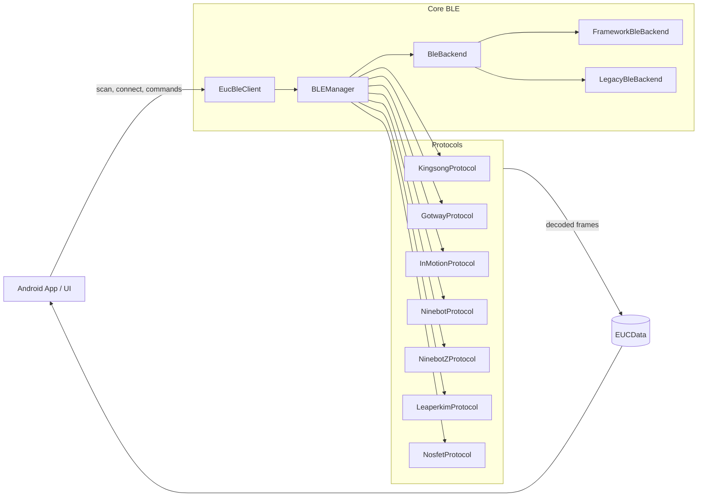

<p align="right">
  <a href="../">FR</a> | <strong>EN</strong>
</p>

# EUC BLE Library

Bluetooth Low Energy library for Electric Unicycles (EUC) – designed for **modern Android applications**, with a **protocol layer tested against real wheels** and a modular BLE backend.

> GroupId: `io.github.tritbool`  
> ArtifactId: `euc-ble-library`  
> Module: `euc-ble-core`

---

## Why this library?

Most EUC BLE libraries rely on a handful of hand‑crafted frames and a monolithic BLE engine.  
This project takes a different approach:

- **Real protocols, real frames**: decoding is validated against WheelLog captures from KingSong, Begode/Gotway, InMotion, Ninebot, Leaperkim, and Nosfet wheels.
- **Modular architecture**: clear separation between the BLE backend, protocol implementations, data models, and the WheelLog adaptation layer.
- **End‑to‑end async**: non‑blocking callbacks, Kotlin `Flow`, and coroutines for telemetry streaming.
- **Testable**: offline JUnit 5 tests (no BLE emulator required), abstract backend for A/B switching between the legacy engine and the new engine.

---

## Key features

- **Multi‑vendor support**  
  KingSong, Gotway/Begode, InMotion, Ninebot (standard + Z‑series), Leaperkim/Veteran, Nosfet.

- **Simple client API**  
  Single entrypoint `EucBleClient` with `ConnectionCallback`, `DataCallback`, and `ErrorCallback` on the app side.

- **Extensible BLE backend**
    - `BLEManager`: BLE core.
    - `BleBackend` + `FrameworkBleBackend` + `LegacyBleBackend` + `SwitchableBleBackend`: progressive migration from an existing engine (e.g., WheelLog).

- **Rich data model**  
  `EUCData` exposes speed, voltage, current, temperature, battery level, distance, power, charging state, ride time, and more.

---

## Architecture at a glance



- The **app** only talks to `EucBleClient` or the abstract backend.
- The **BLE core** handles scan, connect, reconnect, errors, and dispatches to protocols.
- **Protocols** turn raw frames into `EUCData` and expose command support.

---

## Asynchrony & data flows

- `EucBleClient` callbacks are invoked from background contexts, never guaranteed to run on the main thread – it’s up to you to switch to `Dispatchers.Main` for UI work.
- The protocol core exposes:
    - `Flow<EUCData>` for decoded telemetry.
    - `Flow<ByteArray>` (`rawFrameFlow`) for raw frames (useful for logging / debugging).

Example usage on the app side:

```kotlin
val client = EucBleClient(context)

client.setConnectionCallback(object : ConnectionCallback() {
    override fun onDeviceDiscovered(device: EUCDevice) {
        client.connect(device)
    }
})

client.setDataCallback(object : DataCallback {
    override fun onDataReceived(data: EUCData) {
        // process telemetry on an appropriate dispatcher
    }
})

client.setErrorCallback(object : ErrorCallback {
    override fun onError(error: BLEException) {
        // fine-grained error handling
    }
})

client.initialize()
client.startScan()
```

---

## Test coverage & quality

### Code coverage

- **≈ 84% line coverage on protocol/model/frame code**, measured with JaCoCo on debug unit tests.
- Reports generated in CI:
    - Full report: all classes + utilities.
    - “Focused” report: only `protocols`, `models`, and `frames` to reflect the critical decoding paths.

HTML coverage reports are published under:

- [`/test-coverage/full/`](./test-coverage/full/) – global view.
- [`/test-coverage/focused/`](./test-coverage/focused/) – protocols / models / frames only.

*(See the “Test coverage reports” section below.)*

### Test methodology

Protocols are tested against **real BLE captures**:

- WheelLog captures exported as CSV (`RAWWHEELLOG`) for each brand.
- Replayed offline via JUnit 5, with no physical device or BLE emulator required.
- Brand‑specific integration tests (`WheelLogKingsongTest`, `WheelLogGotwayTest`, etc.) that validate the full decoding pipeline.

Additionally:

- “No‑drop” tests (`NoDropTest`): no decoded frame must be silently dropped.
- Protocol parity contracts (`ProtocolParityContractTest`): enforce consistent field semantics across protocols.
- Frequency analysis per brand (`BleFrequencyAnalysisTest`).

---

## Test coverage reports

To make coverage visible:

- CI generates full and focused JaCoCo HTML reports.
- These reports are copied into `site/test-coverage/` and published via GitHub Pages, for example:

```text
site/
  index.md                  # this page
  api/                      # Dokka docs
    index.html
    ...
  test-coverage/
    full/                   # JaCoCo full report
      index.html
      ...
    focused/                # JaCoCo focused (protocols/models/frames)
      index.html
      ...
```

You can link directly to:

- `https://tritbool.github.io/euc_ble_library/test-coverage/full/`
- `https://tritbool.github.io/euc_ble_library/test-coverage/focused/`

as a “health check” for the library.

---

## Using it in an app

### Maven Central dependency

```kotlin
dependencies {
    implementation("io.github.tritbool:euc-ble-library:0.0.1")
}
```

### Android BLE permissions

Android BLE requires:

- `BLUETOOTH_SCAN` / `BLUETOOTH_CONNECT` permissions (and sometimes location).
- Explicit handling of Bluetooth & Location state (disabled, not granted).
- Tests on **physical devices** (no BLE support in the emulator).

The library exposes structured errors via `BLEException` and `ErrorCallback` to handle these cases.

---

## API documentation

- **Home** (this page):  
  `https://tritbool.github.io/euc_ble_library/`

- **Kotlin API reference (Dokka)**:  
  `https://tritbool.github.io/euc_ble_library/api/`

The Dokka reference is automatically regenerated on every push to `main` and published under `/api/` via GitHub Actions.

---

## Roadmap

- ✅ Stable BLE core (`BLEManager`, `EucBleClient`, abstract backend).
- ✅ KingSong / Gotway‑Begode / InMotion / Ninebot / Ninebot Z / Leaperkim / Nosfet protocols.
- ✅ Test suite based on real captures + JaCoCo coverage reports.
- ✅ Maven Central publication & Dokka API docs.
- ☐ Sample application.
- ☐ Edge cases and new firmwares driven by field feedback.

---

## Contributing

Issues, PRs, and additional WheelLog captures (new wheels, new firmwares, tricky edge cases) are all welcome.  
Repository: <https://github.com/Tritbool/euc_ble_library>.