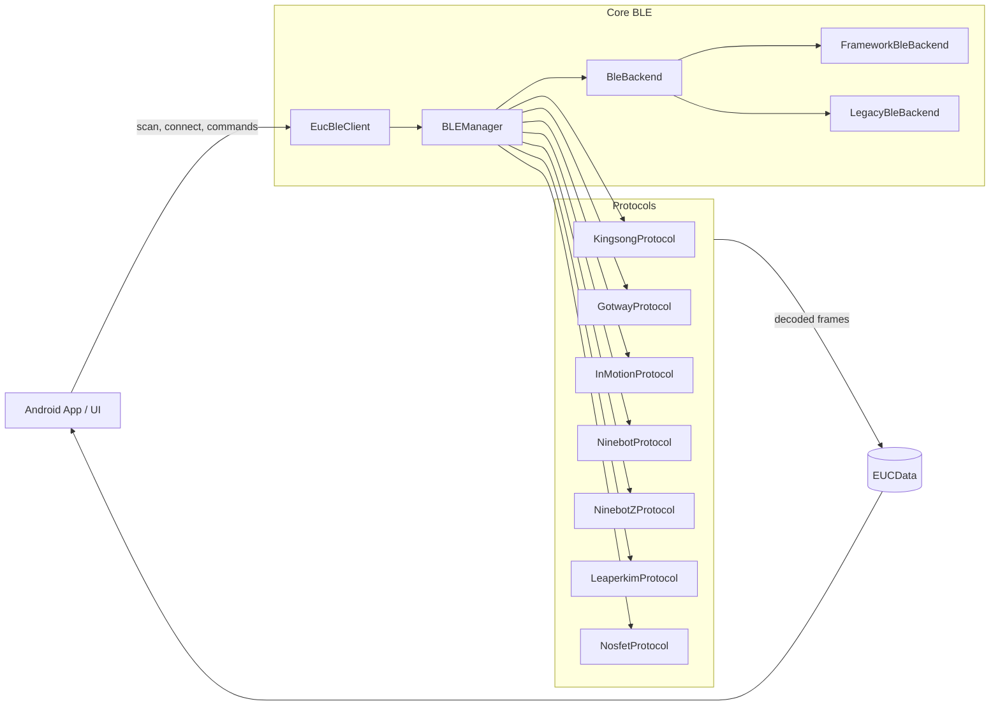

<p align="right">
  <strong>FR</strong> | <a href="./en/">EN</a>
</p>

# EUC BLE Library

Bibliothèque Bluetooth Low Energy pour monocycles électriques (EUC) – pensée pour des **applications Android modernes**, avec une **couche protocole testée sur de vraies roues** et un backend BLE modulaire.

> GroupId: `io.github.tritbool`  
> ArtifactId: `euc-ble-library`  
> Module: `euc-ble-core`

---

## Pourquoi cette librairie ?

La plupart des libs BLE EUC se contentent de quelques trames “faites à la main” et d’un moteur BLE monolithique. 
Ici, l’objectif est différent :

- **Vrais protocoles, vraies trames** : décodage validé sur des captures WheelLog issues de roues KingSong, Begode/Gotway, InMotion, Ninebot, Leaperkim, Nosfet.
- **Architecture modulaire** : séparation nette entre backend BLE, protocoles, modèles de données et couche d’adaptation WheelLog.
- **Asynchrone de bout en bout** : callbacks non bloquants, `Flow` Kotlin et coroutines pour le streaming de télémétrie.
- **Testable** : tests JUnit 5 offline (pas besoin d’émulateur BLE), backend abstrait pour A/B entre moteur legacy et nouveau moteur.

---

## Features clés

- **Prise en charge multi‑constructeurs**  
  KingSong, Gotway/Begode, InMotion, Ninebot (standard + Z‑series), Leaperkim/Veteran, Nosfet.

- **API client simple**  
  Entrée unique `EucBleClient` avec callbacks `ConnectionCallback`, `DataCallback`, `ErrorCallback` côté app.

- **Backend BLE extensible**
    - `BLEManager` : cœur BLE.
    - `BleBackend` + `FrameworkBleBackend` + `LegacyBleBackend` + `SwitchableBleBackend` : adaptation progressive depuis un moteur existant (par ex. WheelLog).

- **Modèle de données riche**  
  `EUCData` expose vitesse, tension, courant, température, niveau de batterie, distance, puissance, état de charge, temps de ride, etc.

---

## Architecture en un coup d’œil



- **App** parle uniquement à `EucBleClient` ou au backend abstrait.
- **Core BLE** gère scan, connexion, reconnection, erreurs et dispatch vers les protocoles.
- **Protocoles** convertissent des trames brutes en `EUCData` et exposent les commandes supportées.

---

## Asynchronicité & Flux de données

- Les callbacks de `EucBleClient` sont invoqués depuis des contextes de fond, jamais garantis sur le main thread – à toi de `Dispatchers.Main` pour l’UI.
- Le cœur protocole expose :
    - `Flow<EUCData>` pour la télémétrie décodée.
    - `Flow<ByteArray>` (`rawFrameFlow`) pour les trames brutes (utile pour logger / debug).

Exemple d’utilisation côté app :

```kotlin
val client = EucBleClient(context)

client.setConnectionCallback(object : ConnectionCallback() {
    override fun onDeviceDiscovered(device: EUCDevice) {
        client.connect(device)
    }
})

client.setDataCallback(object : DataCallback {
    override fun onDataReceived(data: EUCData) {
        // traiter la télémétrie sur un dispatcher adapté
    }
})

client.setErrorCallback(object : ErrorCallback {
    override fun onError(error: BLEException) {
        // gestion fine des erreurs
    }
})

client.initialize()
client.startScan()
```

---

## Couverture de tests & qualité

### Couverture de code

- **≈ 84 % de couverture sur le code protocole/modèles/frames**, mesurée par JaCoCo sur les tests unitaires debug.
- Rapports générés en CI :
    - Rapport complet : classes + utilitaires.
    - Rapport “focused” : uniquement `protocols`, `models`, `frames` pour refléter la partie critique de décodage.

Les rapports HTML de couverture sont publiés sous :

- [`/test-coverage/full/`](./test-coverage/full/) – vue globale.
- [`/test-coverage/focused/`](./test-coverage/focused/) – uniquement protocole / modèles / frames.

*(Voir plus bas la section “Test coverage reports”.)*

### Méthode de test

Les protocoles sont testés avec de **vraies captures BLE** :

- Captures WheelLog exportées en CSV (`RAWWHEELLOG`) pour chaque marque.
- Rejouées offline via JUnit 5, sans appareil physique ni émulateur BLE.
- Tests d’intégration par marque (`WheelLogKingsongTest`, `WheelLogGotwayTest`, etc.) qui valident le pipeline complet de décodage.

En plus :

- Tests de non‑perte de trames (`NoDropTest`) : aucune trame décodée ne doit être silencieusement ignorée.
- Contrats de parité entre protocoles (`ProtocolParityContractTest`) pour garantir une sémantique cohérente des champs.
- Analyses de fréquence d’émission par marque (`BleFrequencyAnalysisTest`).

---

## Test coverage reports

- La CI génère des rapports JaCoCo HTML complets et “focused”.
- Ces rapports sont copiés dans le dossier `site/test-coverage/` puis publiés via GitHub Pages:


- [https://tritbool.github.io/euc_ble_library/test-coverage/full/](https://tritbool.github.io/euc_ble_library/test-coverage/full/)
- [https://tritbool.github.io/euc_ble_library/test-coverage/focused/](https://tritbool.github.io/euc_ble_library/test-coverage/focused/)

---

## Intégration dans une app

### Dépendance Maven Central

```kotlin
dependencies {
    implementation("io.github.tritbool:euc-ble-library:0.0.1")
}
```

### Permissions & BLE Android

Le BLE Android impose :

- Permissions `BLUETOOTH_SCAN` / `BLUETOOTH_CONNECT` (et parfois localisation).
- Gestion explicite de l’état Bluetooth & Location (désactivé, non accordé).
- Tests sur **appareils physiques** (pas d’émulateur BLE).

La lib expose des erreurs structurées via `BLEException` et `ErrorCallback` pour couvrir ces cas.

---

## Documentation API

- **Home** (cette page) :  
  [https://tritbool.github.io/euc_ble_library/](https://tritbool.github.io/euc_ble_library/)

- **Référence API Kotlin (Dokka)** :  
  [https://tritbool.github.io/euc_ble_library/api/](https://tritbool.github.io/euc_ble_library/api/)

La référence Dokka est regénérée automatiquement à chaque push sur `main` et publiée sous `/api/` via GitHub Actions.

---

## Roadmap

- ✅ Core BLE stable (`BLEManager`, `EucBleClient`, backend abstrait).
- ✅ Protocoles KingSong / Gotway-Begode / InMotion / Ninebot / Ninebot Z / Leaperkim / Nosfet.
- ✅ Suite de tests basée sur captures réelles + rapports de couverture JaCoCo.
- ✅ Publication Maven Central & doc API Dokka.
- ☐ Application de démonstration.
- ☐ Cas bord et nouveaux firmwares basés sur retours terrain.

---

## Contribuer

Toute issue, PR ou capture WheelLog supplémentaire (nouvelle roue, nouveau firmware, edge case) est la bienvenue.  
Voir le dépôt : <https://github.com/Tritbool/euc_ble_library>.